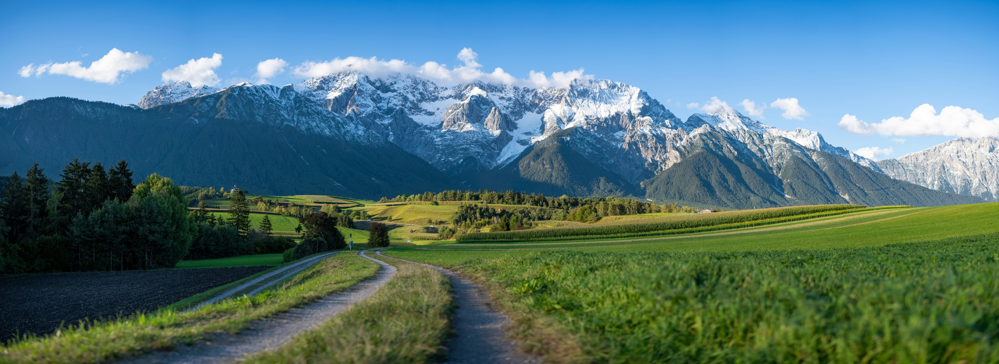

# Image-GS Compression Cyramid

Project developed for AI-assisted computer graphics class.

The goal is to implement a large image compression algorithm based on 2D Gaussian Splatting ([Image-GS](https://github.com/NYU-ICL/image-gs/)) using a pyramid approach. Instead of fitting a high-resolution image in a single pass, the system breaks down the image into multiple levels of detail, fitting the “differences” (residuals) between levels to optimize the representation of information.

## Algorithm

Here is an example of a pyramid constructed by the algorithm:

| Level |                       Image                        | Resolution |
|:-----:|:--------------------------------------------------:|:----------:|
|   0   |   |  1024x256  |
|   1   |  |  2048x512  |
|   2   |  |  4096x1024 |
|   3   |  |  8192x2048 |
||||

The algorithm works as follows:


At iteration _i_, the image in the pyramid at level _i_ is reconstructed (Sum _i_) by adding the reconstruction at level _i-1_ (Sum _i-1_) to the residual at level _i_ (Residual _i_).  
The residual is the difference between the image in the pyramid at level _i_ and the reconstruction at level _i-1_ (Sum _i-1_).  
At iteration _0_, the image at level _0_ in the pyramid is only fitted and upsampled using Image-GS, thus obtaining _Sum 0_.

## Setup and Run

Install Image-GS in main directory following their instructions [here](https://github.com/NYU-ICL/image-gs?tab=readme-ov-file#setup).  
Place your images in the media folder, you need to have a folder structure like this:
```
image-gs-compression-pyramid
├── gs_image_compression.py
└── image-gs
    └── media
        └── images
            └── image-name
                └── image-name.jpg

```

Activate conda environment with:
```
conda activate image-gs
```

Run the algorithm with:
```
python gs_image_compression.py
```

In the script there are global variables to be modified based on your specific case:
- N_GAUSSIANS: number of gaussians that Image-GS will use.
- MIN_RES: minimum resolution (height) for the pyramid (it must be >=160).
- IMG_NAME: name of the image file without extension.
- IMG_FORMAT: extension of the input image.